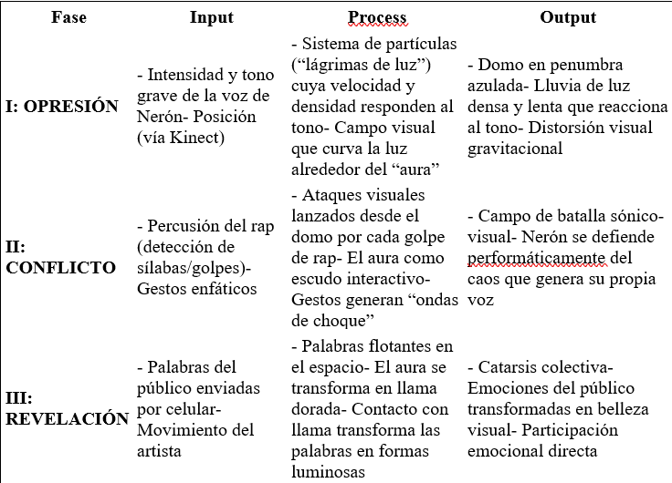

# Unidad 2

## 🔎 Fase: Set + Seek

### Actividad 01

#### Inputs 

Escogi el video del capitulo 2 de Arturs Skutelis, y para el este proyevto el unico input que yo veo es la movilidad del artista en el escensario. Tipo sus movimentos, forma de caminar, recorridos. 

#### Process 

Se realiza con una camara a tiempo real que caputa los mivientos que se le conoce como Kinect que es la misma tecnologia que usaba el xbox y la Wii, y todos estos movientos sosn interprestado y asociados a restuesta casi predeterminada ya que garcaias a una cosas externa se pueden seleccionar cual se va a mostrar.

#### Outputs 

El unicio output que visualizo es la pantalla princiapl del escenario donde se reflan de diversas formas viaules el input ingresado. 

### Actividad 02

#### Mapa

#### ¿Qué elemento del diseño te parece más innovador y por qué?
Lo más innovador es la transformación semántico-visual de las palabras del público en la Fase III. No solo se trata de una visualización pasiva, sino de una reinterpretación artística emocional en tiempo real, donde el público se ve reflejado. Esta interacción transforma el espectador en co-creador y canaliza emociones como “miedo” o “soledad” en símbolos de esperanza y belleza.

#### ¿Cómo crees que la experiencia del público cambiaría si uno de los inputs —por ejemplo, las palabras del público— fuera eliminado?
Si se eliminara ese input, la dimensión participativa y emocional del cierre se debilitaría enormemente. La Fase III dejaría de ser una catarsis colectiva para volverse únicamente contemplativa. El público ya no vería sus propias emociones reflejadas ni transformadas, lo que podría romper el arco emocional del performance. La narrativa pasaría de ser compartida a ser exclusivamente del artista, perdiendo poder simbólico.

### Actividad 03

#### Explica con tus propias palabras la diferencia entre un “evento” en una película tradicional y un “nodo generativo” en la experiencia de “Prometeo”.

Un evento en un pelicula tradional es algo lineal que aunque uno esta experimentando la pelicula por primera vez uno puede ir intullendo su final, y hasta su desarrollo mismo; obviamente despues de verla la primera vez ya se sabe de memoria su final y desarrollo. Mientras que en prometeo nadie, ni siquiera el mismo artista o creador, sabra que va a pasar ya que estas cambian de forma constante ademas de que se influencia con el publico para volverse aun mas unicas. 

#### ¿Quién crees que tiene más “poder” o “agencia” en la creación de la experiencia final de “Prometeo”: el artista, el público o los diseñadores del sistema? Justifica tu respuesta.
Realmente el artista y el publico ya que el diseñador pone su conocimienta pra que el arte se genere pero ni el puede asegurara a ciencia cierta lo que se va a generar. El artista mientras tanto puede influenciar un poco mas que el publico ya que el es la base de la generacion. 

#### El documento dice que el objetivo es generar “EPIFANÍAS” en lugar de “empatía”. ¿Qué crees que significa esto en el contexto de una experiencia inmersiva?

Una epifanía no es solo entender o compartir una emoción (como ocurre con la empatía), sino vivir un momento de revelación personal, una comprensión y transformacion que cambia tu forma de ver el mundo, a ti mismo o la situación.
