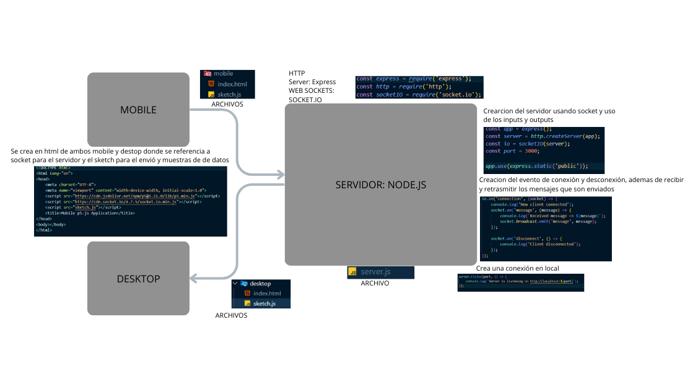

# Unidad 3

## 🔎 Fase: Set + Seek

### Actividad 01


### Actividad 02
#### Codigo de visuales 
``` js
const socket = io();

socket.on('connect', () => {
    console.log('Visuales conectadas');
});

socket.on('message', (data) => {
    console.log('Datos recibidos en visuales:', data);
});

socket.on('disconnect', () => {
    console.log('Visuales desconectadas');
});
```
#### Codigo del nuevo mobile 
``` js
// Conexión con el servidor usando Socket.IO
const socket = io();

// Cuando el cliente se conecta, envía datos simulados al servidor
socket.on('connect', () => {
    console.log('Connected to server');
    const controlData = {
        type: 'control',
        x: Math.random() * 100,
        y: Math.random() * 100,
        timestamp: Date.now()
    };
    socket.emit('message', controlData);
    console.log('Mobile sent:', controlData);
});
```
#### Codigo del nuevo desktop
``` js
const socket = io();

socket.on('connect', () => {
    console.log('Mobile client connected');
    
    // Enviar un dato simple
    const data = {
        value: "test from pc"
    };
    socket.emit('message', data);
    console.log('Sent:', data);
});
```

[https://youtube.com/shorts/Tez4yrwVNIw?si=AIjaTL0hYua9dcjE] 
